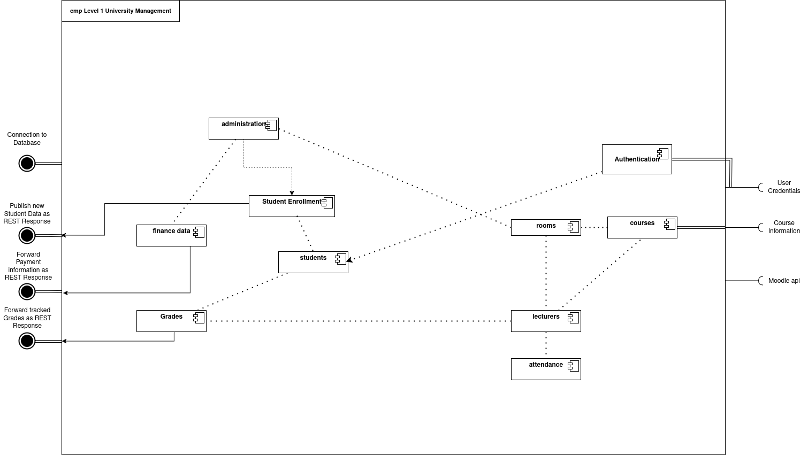
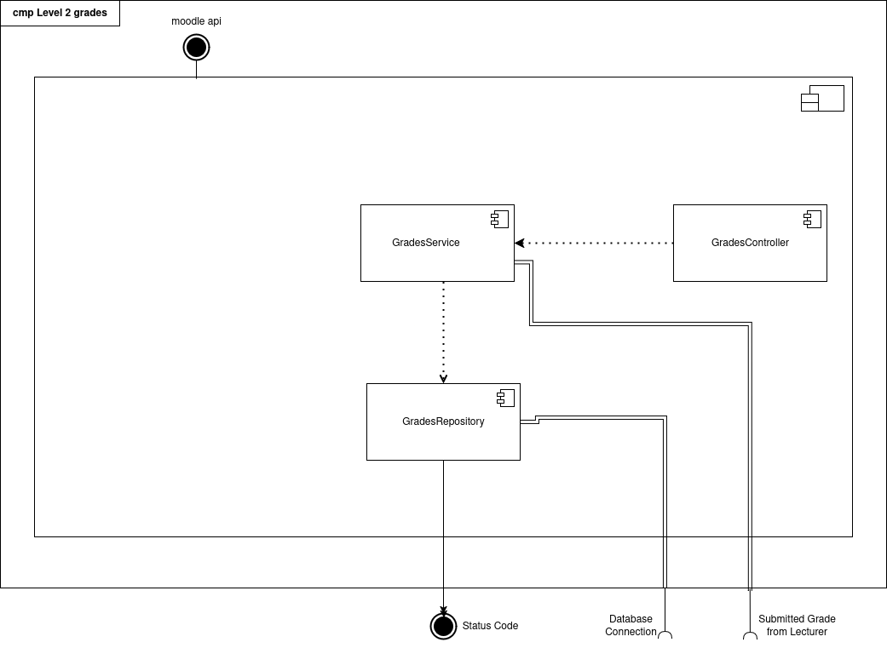

# Building Block View

## Level 1

This is an overview over all components of the university management app. It connects to a database, publishes data 
about students, payments and grades and connects to the moodle api to make sure that data is kept consistent between 
moodle and the university management application.

## Level 2

The grades component has a GradesController which handles REST requests, a GradeService which contains all the business 
logic that are needed to store grades data and a GradesRepository which communicates with the database through the 
database connection. 
