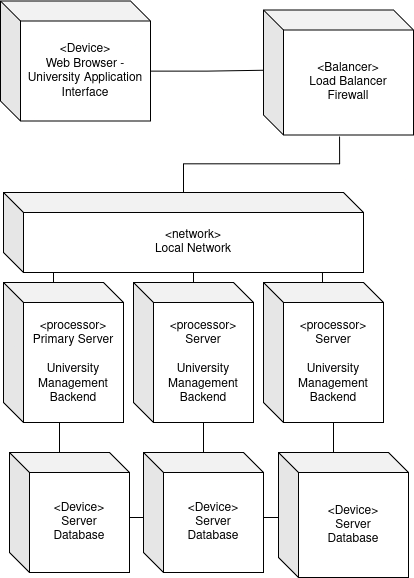

Deployment View 
===============

Infrastructure Level 1
----------------------

Motivation

: Our application is divided in three main parts, the web client running in the browser of the client connecting to the 
server, the server that runs the backend that processes data and the database storing data. In between the client and 
the server we have a load balancer that also functions as a firewall. 

Quality and/or Performance Features

: To ensure a good performance for users we deploy multiple instances of our backend server that each get an own database
instance. The databases have to communicate with each other to ensure that the data is replicated and consistent.

Mapping of Building Blocks to Infrastructure

: Each instance of the backend and of the database runs on its own server and the load balancer runs on its own machine.   
