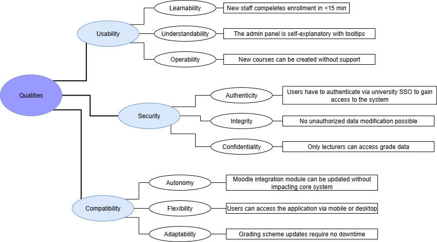

# Quality Requirements

This section contains all quality requirements as quality tree with
scenarios. The most important ones, usability, security and compatibility, have already been described in
section 1.2. (quality goals)
In this chapter those goals are refined into scenarios that guide the architectural decisions.

## Quality Tree

The tree structure with priorities provides an overview for the main- and sub-quality requirements and their respective scenarios.

## Quality Scenarios

The usability requirement can be broken down further into learnability, understandability and operability.

**Learnability** describes how quickly new users can learn to use the system effectively.
This can be visualized in a user scenario, for example: A new administration staff member completes an enrollment in under 15 minutes during their first time using the system, without assistence.

**Understandability** is the concept that a system should be presented so it can easily be understood. A scenario for this would be: An admin user navigates and successfully completes task in the admin panel, only aided by tooltips.

**Operability** is what makes a system easy to operate and control. Operability includes scenarios like: A lecturer can create new courses without external support.

The main goal of security can be split into authenticity, integrity and confidentiality.

**Authenticity** describes that the identity of a subject or resource is the one claimed. In order for this to be fulfilled the user scenario for the university software is this: Users have to authenticate themselves via university SSO to gain access to the system.

**Integrity** means that a system and its data are protected from unauthorized modification. The scenario for this is: Users can only modify data with proper authorization.

**Confidentiality** ensures that data is only accessible to those authorized to have access. The user scenario for this: Only lecturers can access grade data.

The third main quality requirement compatibility consists, among others, of autonomy, flexibility and adaptability.

**Autonomy** means the ability to function without external influence. A scenario for this would be: The Moodle integration module can be updated without impacting the core system.

**Flexibility** is the capability of a product to serve different or expanded requirements or infrastructures and environments. This can be visualized in the scenario: Users can access the application via mobile phone or desktop.

**Adaptability** describes that a product can be effectively and efficiently adapted for different hardware, software or other operational or usage environments. A scenario for this is: Grading scheme updates in the software require no downtime.

Scenarios make quality requirements concrete and allow to more easily
measure or decide whether they are fulfilled.
These quality goals and their scenarious should make the evaluation process and assessment of the systems architecture easier and allow for it to be measurable.
